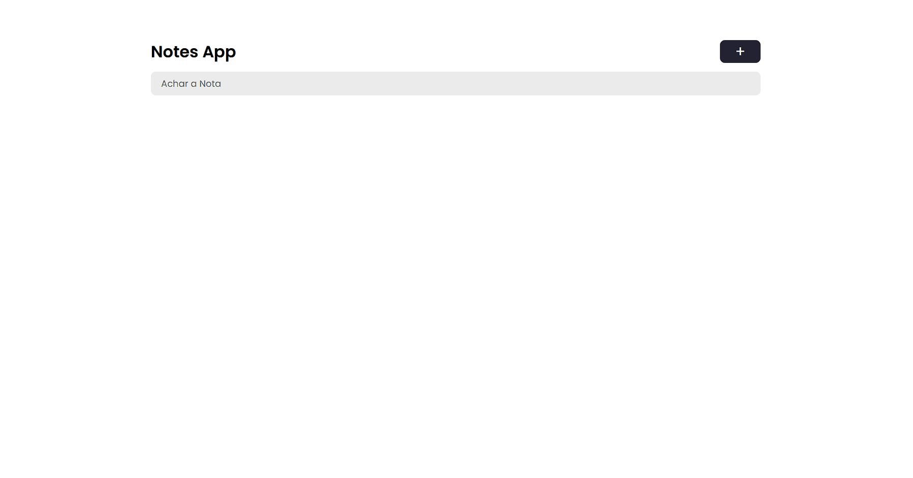

<h1 align="center">
    DevNotes
</h1>

<h4 align="center"> 
	Concluído 🚀
</h4>


## 🎨 Layout

O layout da aplicação:


<p align="center" style="display: flex; align-items: flex-start; justify-content: center;">
  
</p>

---


## 💻 Sobre o projeto

DevNotes - é uma webapp de notas em que o usuario pode: criar, ver, deletar e editar (CRUD) as notas.

---

## ⚙️ Funcionalidades

- [x] Usuario pode criar as notas.
- [x] Usuario pode deletar as notas.
- [x] Usuario pode editar as notas.
- [x] usuario pode filtrar as notas.

---

## 🛠 Tecnologias

As seguintes ferramentas foram usadas na construção do projeto:

-   **[ReactJS](https://github.com/reactjs)**
-   **[Styled-Components](https://github.com/styled-components)**
-   **[Javascript](https://github.com/topics/javascript)**

---

## 🚀 Como executar o projeto

-   Você pode testar o projeto aqui: **[]()**

```bash

# Clone este repositório
$ git clone 

```

---
